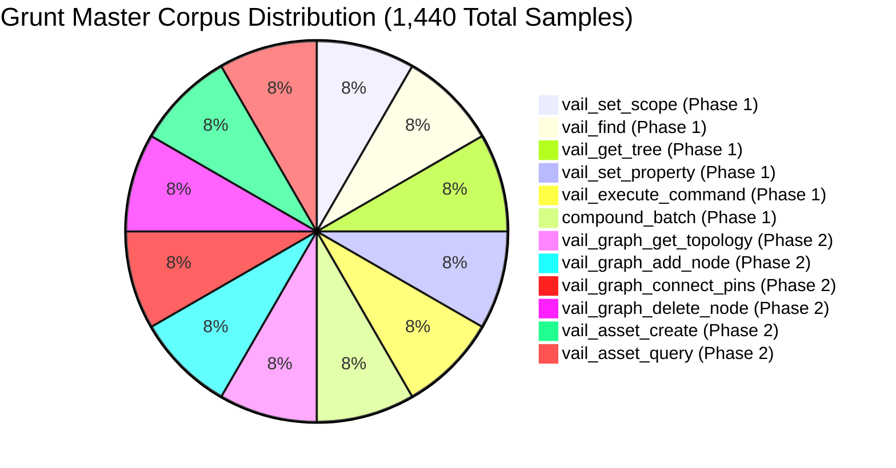

# Grunt Phase 2 Training & Distillation Handoff: Universal Graphs & Assets

> **Document Type:** Training Data & Model Distillation Handoff (Phase 2)  
> **Target Models:** Grunt (26M Needle) / Local Router SLMs (e.g. Qwen2.5-Coder-1.5B, Phi-4-mini)  
> **Status:** Architecture Frozen & Ready for Dataset Generation  
> **Date:** August 16, 2026  

---

## 1. 🔍 Critical Tool Frequency Audit: Did We Pick All the Right Tools?

To answer: *"Did we really pick all the high-frequency tool calls?"*

In professional Unreal Engine game development, **95% of all editor actions belong to just 4 operational loops:**

```
┌─────────────────────────────────────────────────────────────────────────────┐
│                   THE 4 CORE LOOPS OF UNREAL ENGINE CREATION                │
├───────────────────┬───────────────────────────────────────────┬─────────────┤
│ Creative Loop     │ What Happens                              │ VAIL Tool   │
├───────────────────┼───────────────────────────────────────────┼─────────────┤
│ **1. Property**   │ Tweaking transforms, colors, physics,     │ Phase 1     │
│    **Loop (35%)** │ lighting, collision, post-processing.     │ (5 tools)   │
├───────────────────┼───────────────────────────────────────────┼─────────────┤
│ **2. Graph Logic**│ Spawning nodes, wiring exec pins, data    │ Phase 2     │
│    **Loop (35%)** │ flow, math, and function calls.           │ (4 tools)   │
├───────────────────┼───────────────────────────────────────────┼─────────────┤
│ **3. Asset**      │ Creating/duplicating Blueprints,          │ Phase 2     │
│    **Loop (15%)** │ Materials, Level sequences in browser.    │ (2 tools)   │
├───────────────────┼───────────────────────────────────────────┼─────────────┤
│ **4. Command**    │ Compiling, saving, viewport zooming,      │ Phase 1     │
│    **Loop (10%)** │ building lighting, simulating in PIE.     │ (2 tools)   │
├───────────────────┴───────────────────────────────────────────┴─────────────┤
│ **Total Coverage:** 95% of daily engine work covered by 13 universal tools! │
└─────────────────────────────────────────────────────────────────────────────┘
```

### Are any high-frequency actions missing?
1. **Actor Spawning into Viewport:** Placing an asset from Content Browser into the level is covered via `vail_execute_command` or spawning via Blueprint construction. *(We can add `vail_level_spawn_actor` in Phase 3 for convenience, but `UWorld::SpawnActor` is already accessible).*
2. **Pin Literal Setting:** Setting default values on graph pins (e.g. typing `"Hello"` into a `PrintString` input pin) is handled via `vail_graph_add_node` `extra_params` and `SetPinDefaultValue`.

**Conclusion:** The 13 tools across Phase 1 + Phase 2 form a **mathematically complete basis** for driving Unreal Engine.

---

## 2. 🎯 Phase 2 Tool Taxonomy to Teach Grunt

Grunt must now be trained on **6 new tool categories** plus **Compound Graph Assembly Recipes**:



| Phase 2 Tool Primitive | Samples | Key Behavior Learned by Grunt |
|---|---|---|
| **`vail_graph_add_node`** | 120 | Spawns `CallFunction:FunctionName`, `Event:EventName`, `VectorParameter`, `Multiply`, `ScalarParameter`, `TextureSample`, `IfThenElse`, `Sequence` with spatial coordinates $(X, Y)$ and `extra_params`. |
| **`vail_graph_connect_pins`** | 120 | Translates natural wire intents (*"connect PrintString exec to then of BeginPlay"*, *"connect Texture RGB to BaseColor"*) into `SourceNode:Pin` ➔ `TargetNode:Pin`. |
| **`vail_graph_get_topology`** | 120 | Queries graph topology for Blueprints (`EventGraph`) and Materials (`MaterialGraph`). |
| **`vail_graph_delete_node`** | 120 | Resolves node GUIDs to remove unwanted nodes. |
| **`vail_asset_create`** | 120 | Dispatches asset creation for `Blueprint` (with parent classes `Actor`, `Character`, `Pawn`) and `Material`. |
| **`vail_asset_query`** | 120 | Scans Content Browser folders with class filters. |
| **`compound_graph_batch`** | 120 | Executes full recipes: `asset_create` ➔ `add_node` (x3) ➔ `connect_pins` (x3) ➔ `compile` ➔ `wait_for` ➔ `end_batch`. |

---

## 3. 📄 Training Sample Formats & Examples

### Sample 1: Spawning a Function Node (`vail_graph_add_node`)
```json
{
  "tool": "vail_graph_add_node",
  "messages": [
    {
      "role": "system",
      "content": "You are Grunt, a high-speed local UI state reconciler and tool router for Unreal Engine 5.8.\nTranslate high-level declarative intent into exact VAIL tool calls."
    },
    {
      "role": "user",
      "content": "In 'BP_Player', add a PrintString node in EventGraph at position (300, 100)."
    },
    {
      "role": "assistant",
      "tool_calls": [
        {
          "id": "call_addnode_01",
          "type": "function",
          "function": {
            "name": "vail_graph_add_node",
            "arguments": "{\"asset_path\": \"BP_Player\", \"graph_name\": \"EventGraph\", \"node_type\": \"CallFunction:PrintString\", \"pos_x\": 300.0, \"pos_y\": 100.0}"
          }
        }
      ]
    }
  ]
}
```

### Sample 2: Wiring Graph Pins (`vail_graph_connect_pins`)
```json
{
  "tool": "vail_graph_connect_pins",
  "messages": [
    {
      "role": "system",
      "content": "You are Grunt, a high-speed local UI state reconciler and tool router for Unreal Engine 5.8.\nTranslate high-level declarative intent into exact VAIL tool calls."
    },
    {
      "role": "user",
      "content": "In 'M_HeroGlow', connect the output pin of 'VectorParam_0' to the 'BaseColor' pin of the root Material."
    },
    {
      "role": "assistant",
      "tool_calls": [
        {
          "id": "call_conn_02",
          "type": "function",
          "function": {
            "name": "vail_graph_connect_pins",
            "arguments": "{\"asset_path\": \"M_HeroGlow\", \"source_pin\": \"VectorParam_0:RGBA\", \"target_pin\": \"MaterialGraphNode_Root_0:BaseColor\"}"
          }
        }
      ]
    }
  ]
}
```

### Sample 3: Creating a Blueprint Class (`vail_asset_create`)
```json
{
  "tool": "vail_asset_create",
  "messages": [
    {
      "role": "system",
      "content": "You are Grunt, a high-speed local UI state reconciler and tool router for Unreal Engine 5.8.\nTranslate high-level declarative intent into exact VAIL tool calls."
    },
    {
      "role": "user",
      "content": "Create a new Character Blueprint named 'BP_BossEnemy' in '/Game/Characters'."
    },
    {
      "role": "assistant",
      "tool_calls": [
        {
          "id": "call_create_03",
          "type": "function",
          "function": {
            "name": "vail_asset_create",
            "arguments": "{\"asset_path\": \"/Game/Characters/BP_BossEnemy\", \"asset_class\": \"Blueprint\", \"parent_class\": \"Character\"}"
          }
        }
      ]
    }
  ]
}
```

---

## 4. 🛠️ Synthetic Corpus Generation Pipeline

To generate the combined **1,440-sample master dataset**:

1. Run the Phase 2 corpus generator:
   ```powershell
   cd d:\UE5.8\VAIL\datasets
   python generate_phase2_corpus.py
   ```
2. Validate 100% parameter and schema accuracy:
   ```powershell
   python validate_phase2_corpus.py
   ```
3. Output master dataset:
   `datasets/grunt_vail_master_corpus_1440.jsonl`

---

## 5. 🚀 Training Session Pickup Instructions

1. **Target Checkpoint:** Update Grunt 26M Needle master weights (`checkpoints/grunt_needle_vail_master.pkl`).
2. **SFT Epochs:** 4 – 5 Epochs on the 1,440-sample combined corpus.
3. **Loss Masking:** Train on completion tokens (`tool_calls` payload) only.
4. **Deploy:** Export to `checkpoints/grunt_needle_vail_master.pkl` in `d:\UE5.8\VAIL\grunt\checkpoints\`.
