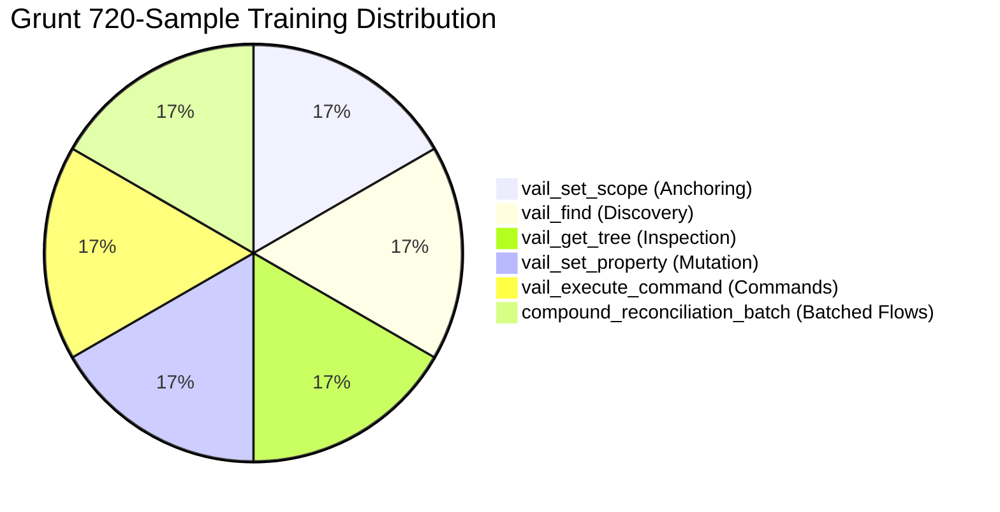

# Grunt Training & Distillation Handoff: VAIL Phase 1

> **Document Type:** Training Data & Model Distillation Handoff  
> **Target Models:** Grunt (26M Needle) / Local Router SLMs (e.g. Qwen2.5-Coder-1.5B, Phi-4-mini)  
> **Status:** Dataset Generated & 100% Schema Validated  
> **Date:** August 16, 2026  

---

## 1. Executive Summary

To eliminate the **Micro-Action Compound Tax** on Frontier cloud models, Grunt acts as a high-speed local **State Reconciler & Tool Router**. 

A synthetic training corpus of **720 fully validated training samples** (120 per tool category) has been synthesized and validated against the frozen UE 5.8 VAIL protocol.

```
┌─────────────────────────────────────────────────────────────────────────────┐
│                              THE DATASET CONTRACT                           │
├───────────────────────────────┬─────────────────────────────────────────────┤
│ Total Training Samples        │ 720 samples (100% Validated)                │
│ Total Tool Invocations        │ 1,440 tool calls                            │
│ Samples per Tool Category     │ 120 samples each (6 categories)             │
│ Target Accuracy Goal          │ 100% JSON-RPC Schema & Parameter Accuracy   │
│ Corpus File Location          │ datasets/grunt_vail_training_corpus.jsonl   │
└───────────────────────────────┴─────────────────────────────────────────────┘
```

---

## 2. Dataset Distribution & Breakdown



| Tool / Pattern Category | Samples | Target Behavior Learned by Grunt |
|---|---|---|
| **`vail_set_scope`** | 120 | Anchors attention to specific Actors, Assets, Details Panels, or Toolbars. |
| **`vail_find`** | 120 | Translates fuzzy natural language queries ("change brightness", "turn off gravity") into exact search parameters. |
| **`vail_get_tree`** | 120 | Queries category subsets (Transform, Physics, Lighting) with controlled `max_depth`. |
| **`vail_set_property`** | 120 | Mutates floats, vectors, booleans, enums, RGBA colors, and asset references. |
| **`vail_execute_command`** | 120 | Dispatches `FUICommandInfo` semantic IDs (`Kismet.Compile`, `LevelEditor.SaveDirect`). |
| **`compound_batch`** | 120 | Emits complete multi-step sequences (`begin_batch` $\rightarrow$ set properties $\rightarrow$ `wait_for` $\rightarrow$ `end_batch`). |

---

## 3. Training Sample Schema & Format

The dataset uses the standard OpenAI / FastMCP ChatML tool-calling format:

```json
{
  "tool": "vail_set_property",
  "messages": [
    {
      "role": "system",
      "content": "You are Grunt, a high-speed local UI state reconciler and tool router for Unreal Engine 5.8.\nYour job is to translate high-level declarative intent and property targets into exact, atomic VAIL tool calls.\nAlways use precise semantic IDs and valid formatted values. Do not hallucinate properties or commands."
    },
    {
      "role": "user",
      "content": "Set property 'RelativeLocation.X' to '500.0'."
    },
    {
      "role": "assistant",
      "tool_calls": [
        {
          "id": "call_setprop_42",
          "type": "function",
          "function": {
            "name": "vail_set_property",
            "arguments": "{\"property_id\": \"RelativeLocation.X\", \"value\": \"500.0\"}"
          }
        }
      ]
    }
  ]
}
```

---

## 4. Toolset & Verification Scripts

The training toolset is stored in `datasets/`:

- `generate_grunt_corpus.py`: Programmatically generates realistic UE 5.8 training pairs using real reflected properties and command IDs.
- `validate_grunt_corpus.py`: Validates every sample against parameter requirements and typing constraints.
- `grunt_vail_training_corpus.jsonl`: The 720-line frozen dataset.

### Validation Output
```text
--- Corpus Validation Summary ---
Total Training Samples: 720
Total Tool Invocations: 1440

Samples per Tool Category:
  • compound_reconciliation_batch : 120 samples
  • vail_execute_command          : 120 samples
  • vail_find                     : 120 samples
  • vail_get_tree                 : 120 samples
  • vail_set_property             : 120 samples
  • vail_set_scope                : 120 samples

[SUCCESS] All 720 training samples passed 100% schema and parameter validation!
```

---

## 5. Single Pickup Instructions for Training Session

When ready to train Grunt or fine-tune your local router model (e.g. via Unsloth, Llama-Factory, or Axolotl):

1. **Dataset Location:**
   `datasets/grunt_vail_training_corpus.jsonl`
2. **Recommended SFT Parameters:**
   - **Epochs:** 3 – 5
   - **Learning Rate:** `2e-4` (for LoRA / QLoRA) or `1e-5` (for full fine-tuning)
   - **Target Modules:** `q_proj, k_proj, v_proj, o_proj, gate_proj, up_proj, down_proj`
   - **Loss Masking:** Train on assistant completions only (`tool_calls` block).
3. **Inference Deployment:**
   - Export fine-tuned weights to GGUF (e.g., `Q4_K_M` or `Q8_0`).
   - Run locally via Ollama / llama.cpp on `localhost:11434` or as an in-process ONNX runtime needle.
