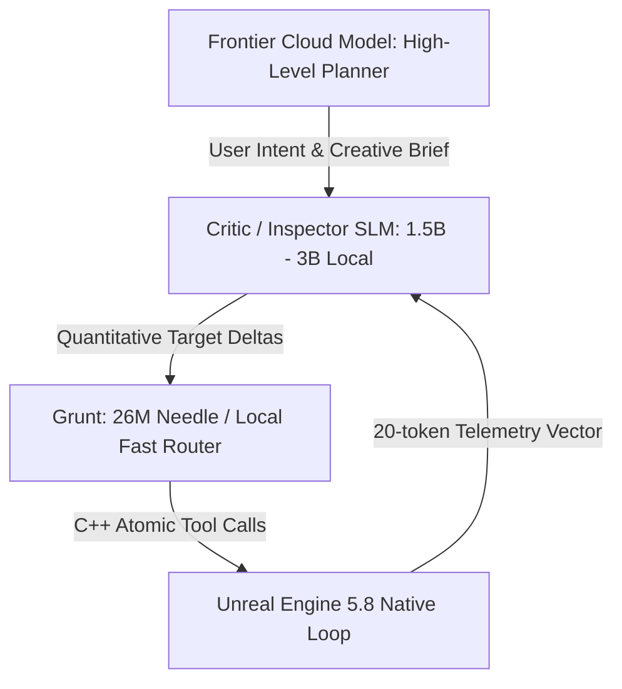

# VAIL Architectural Handoff: Sensory Validation Layer & Local Critic Model

> **Document Type:** Architectural Research & Design Handoff  
> **Status:** Deferred / Parked for Future Phase Integration  
> **Target Models:** Critic/Inspector SLM (1.5B–3B e.g. Qwen2.5-Coder-3B, Llama-3.2-3B, Phi-4-mini)  
> **Date:** August 16, 2026  

---

## 1. Executive Summary & The "Blind Hands" Problem

In Phase 1 and Phase 2, VAIL successfully established a **deterministic, zero-mouse-hijacking dual-channel bridge** for properties, editor commands, universal graph topology (Blueprints/Materials), and asset creation.

However, a fundamental architectural limitation exists in all existing creative tool MCPs:

> **The Agent has precise mechanical hands, but zero sensory proprioception.**

When an agent mutates a property (e.g. setting `LightColor` or `Intensity`), it knows the C++ reflection call succeeded. But it cannot *sense* whether the rendered outcome is a soft romantic twilight or an oversaturated apocalyptic red wall of fire without either:
1. **Human intervention**, or
2. **The Vision/OCR Tax** (transmitting expensive 4K screenshots to cloud frontier models, incurring latency and token costs).

---

## 2. Proposed Solution: Lightweight Sensory Telemetry Vectors

Instead of passing heavy image buffers, Unreal Engine's render and physics pipelines already compute ground-truth mathematical diagnostics. 

Exposing these as **compact JSON telemetry vectors (< 30 tokens)** allows local models to evaluate quality and style in milliseconds without vision processing.

```
┌─────────────────────────────────────────────────────────────────────────────┐
│                 THE 4 PROPOSED SENSORY FEEDBACK VECTORS                     │
├──────────────────────────┬──────────────────────────────────────────────────┤
│ 1. Optical Telemetry     │ Dominant hue/RGB, saturation index, average      │
│    (`vail_sense_optical`)│ luminance (Lux), EV100 exposure, & clipping %.   │
├──────────────────────────┼──────────────────────────────────────────────────┤
│ 2. Spatial Proprioception│ Ground clearance, surface normal, penetration/   │
│    (`vail_sense_spatial`)│ overlap depth, camera frustum visibility %, FOV. │
├──────────────────────────┼──────────────────────────────────────────────────┤
│ 3. Geometric Health      │ Tri count, non-manifold edges, UV overlap %,     │
│    (`vail_sense_mesh`)   │ Nanite status, collision complexity bounds.      │
├──────────────────────────┼──────────────────────────────────────────────────┤
│ 4. Shader Telemetry      │ Instruction count, texture samplers, roughness   │
│    (`vail_sense_shader`) │ distribution, Lumen surface cache coverage.      │
└──────────────────────────┴──────────────────────────────────────────────────┘
```

---

## 3. The 3-Tier Multi-Model Hierarchy (Actor-Critic Topology)



### Why Grunt is NOT the Critic:
* **Grunt (26M Needle):** Specialized exclusively as a high-speed, zero-opinion tool router. It has no latent semantic world knowledge of aesthetics or mood.
* **The Critic (1.5B – 3B Local SLM):** Holds the creative style rubrics and evaluates numeric telemetry against semantic user intent (*"Tuscan Twilight"* vs *"Cyberpunk Neon"*).
* **Tier-1 Deterministic Rubrics (Pure C++ Assertions):** Hard engineering limits (e.g. `tri_count < 50k`, `uncompiled_bps == 0`, `ground_penetration == 0`) are checked by code in 0.1ms with zero tokens.

---

## 4. Decoupling "Style" as Mutable Acceptance Envelopes

Artistic style should not be hardcoded into execution scripts. Instead, **Style is defined as a Target Envelope (Loss Contract)** within the validation layer:

```json
{
  "style_profile": "Tuscan_Sunset",
  "acceptance_envelope": {
    "avg_luminance_lux": { "min": 14000.0, "max": 22000.0 },
    "saturation_index": { "min": 0.40, "max": 0.65 },
    "dominant_hue_degrees": { "min": 25.0, "max": 45.0 },
    "sun_pitch_degrees": { "min": -28.0, "max": -18.0 }
  }
}
```

This allows developers to swap the entire aesthetic personality of a project by changing a single configuration checkpoint without touching Grunt's execution weights.

---

## 5. 🔍 Critical Analysis: What Might Be Missing / Risks

Before implementing this in production, the following open questions must be resolved:

1. **Are Telemetry Vectors Too Primitive for Complex Art?**  
   A 6-float optical vector captures global luminance and dominant hue, but cannot easily capture composition, focal contrast, leading lines, or local character rim lighting without spatial segmentation (e.g. screen-space zone quadrants).
2. **The Risk of Ping-Pong Oscillation:**  
   If the Critic and Worker operate on loose delta feedback, they may oscillate back and forth around target thresholds. Rigid convergence heuristics (e.g., maximum 3 refinement passes) are required.
3. **Non-Linear Pipeline Interactions:**  
   Lumen global illumination, auto-exposure (Eye Adaptation), and post-process color grading LUTs can dramatically alter visual results in non-linear ways that simple property sliders cannot predictably invert.

---

## 6. Phase Integration Status

* **Status:** **Parked & Documented.**
* **Next Steps:** Proceed with the core mechanical capabilities of **Phase 3 (Spatial Spawning, Cine Sequencer, UMG Widget Trees)** and **Phase 4 (Subsystems & Production Tooling)**.
* **Future Pickup:** Revisit this handoff when closed-loop autonomous asset cleanup and automated lighting balancing are scheduled for dedicated evaluation.
